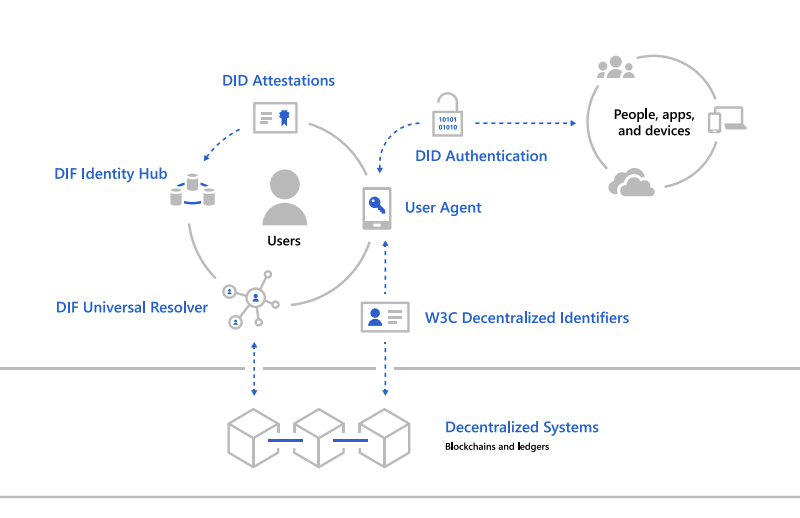
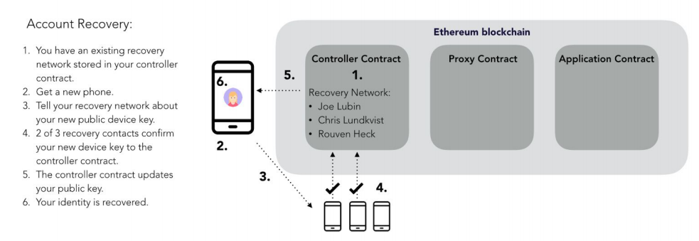
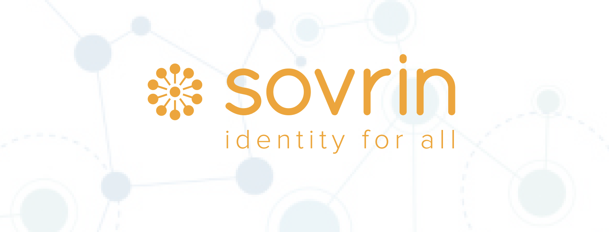
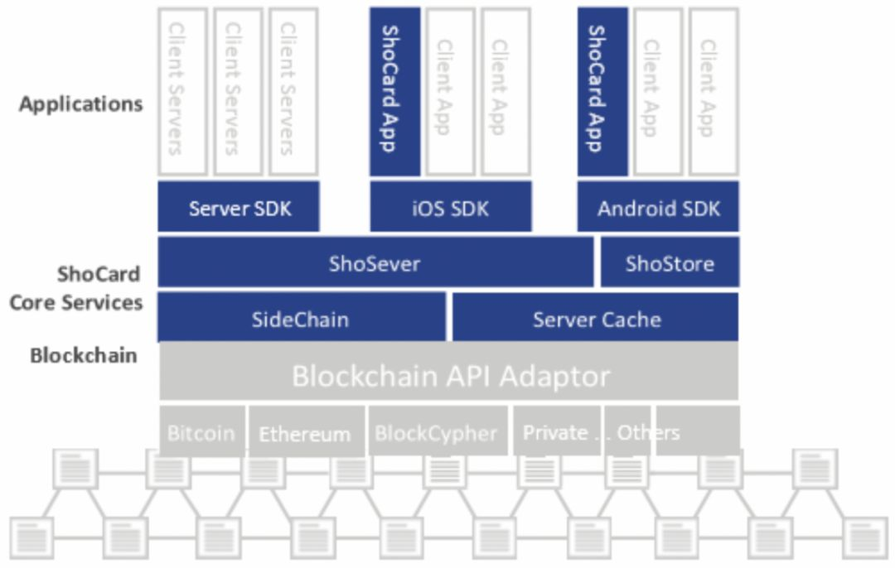

## 背景

DID全称为 Decentralized ID ，也就是去中心化身份。与之相对的则是中心化身份，也是我们平常最为常见的形式。

中心化身份系统的本质上是由中心化的权威机构、公司掌握着身份数据，因此，对数据相关的认证、授权等行为也由中心化机构、公司来控制。而在这个过程里，这些大型的公司（如苹果、亚马逊、腾讯、阿里巴巴等）获得了大量的利润，但只将很少部分的价值给到产生数据的用户身上，并且还使得大量的用户数据暴露在巨大风险之下（中心化服务器遭受攻击等）。

除了以上问题外，由于各大平台都有一套自己的中心化身份系统，使得各个平台之间的数据不互通，形成了数据孤岛。为了解决这个问题，一些公司提出了联盟身份的构想（如微软的Passport计划）。在联盟身份的体系下，用户的身份有了一定的可移植性，用户的数字身份由单一平台控制变为了多个平台共同管理。

但尽管联盟身份一定程度上解决了上述问题，但也仅仅是将权力由单一控制变为寡头垄断，并没有从本质上彻底解决中心化身份带来的隐患。

由此，以用户为中心的去中心化身份构想应运而生，其目的是允许用户控制其数据，保护其隐私并最终通过开放的、抗审查的网络来确保其自由，从而赋予其用户权力。

## 现有方案

目前已经有的较为知名的DID项目主要有以下几个：MicrosoftDID、uPort、Sovrin、Civic、ShoCard。

### MicrosoftDID

微软在2019年，提出了名为“身份覆盖网络”（Identity Overlay Network，简称ION）的项目。它是一个基于比特币的双层网络，通过 Sidetree 协议访问比特币网络，允许用户通过管理公钥基础设施（PKI）来控制自己的数据。

ION的目标是创建一个去中心化的身份生态系统，在这个生态系统中，数以百万计的组织、数十亿的人和无数的设备可以在基于标准和开源组件的互操作系统上安全地交互。

根据白皮书的描述，该项目主要由7大技术模块构成，分别是：W3C Decentralized Identifiers、 Decentralized systems、DID User Agents、 DIF Universal Resolver、DIF Identity Hubs、 DID Attestations、Decentralized apps and services。

- W3C Decentralized Identifiers(去中心化身份标识)，其是由用户创建、拥有和控制，独立于任何的政府或组织。并且，其是全球唯一的标识符，与去中心化公钥基础设施（DPKI）元数据连接。[1]
  
-  Decentralized systems(去中心化系统)，DIDs 最终需要建立在去中心化系统之上，去中心化系统提供了 DPKI 所需的机制和功能。[2]
  
-  DID User Agents(DID 用户代理)，用户代理是让用户能够使用去中心化身份的应用程序。有助于 DIDs 创建、数据和权限管理，以及签名验证 DID 相关的声明。[3]

- DIF Universal Resolver(全局DID解析器),全局 DID 解析器是利用一组 DID 驱动器提供一个标准方法来跨越去中心化系统查找和解析各种 DID。[4]
  
- DIF Identity Hubs(身份中心),身份中心是个人数据加密存储的可复制网格，由云和边缘实例（如移动电话、电脑或智能扬声器）组成，便于身份数据存储和身份交互。[5]
  
- DID Attestations(DID 认证),DID 认证是基于 DID 的认证协议。这可能是 DID 技术落地的时候最先被最终用户感知的方式，就是可以用 DID 来登陆各种支持 DID 的服务。[6]
  
- Decentralized apps and services(去中心化应用和服务),与个人身份数据存储中心相结合的 DIDs，可以创建全新的应用和服务，它们在用户身份中心存储数据，并在受权范围内进行操作。[7]

通过上述的简单介绍，我们可以看到微软的这套DID方案，在技术架构上较为全面。并且其通过双层网络的方式，既使用了经过长时间证明的最为安全的区块链（比特币）、继承了去中心化特性，同时又解决了比特币本身性能过差的问题。

### uPort

根据官网的描述，uPort是用于构建以用户为中心的去中心化应用的工具和协议的集合，它建立在开放标准和开放源代码库之上，它允许用户进行身份验证、数字签名、与以太坊上其他应用进行交互等功能。

该项目旨在打造一个安全、易用的自主身份识别系统。uPort技术由三个主要组件组成：智能合约、开发者库、移动应用程序。

移动应用程序保存用户的密钥；智能合约则构成了身份识别的核心，并且包含了让用户在移动设备丢失时恢复其身份的逻辑；开发人员库用于第三方应用程序开发人员将uPort支持集成到他们的应用程序中。

下面是以上三个模块包含的主要组件。

**智能合约组件:**

- 代理合约是一种最小的合约，用于转发交易，其地址是uPort身份的核心标识。

- 控制器合约维护对代理合约的访问控制，并允许附加功能。

- 恢复仲裁合约有助于在发生密钥丢失时恢复身份。

- 注册合约维护uPort标识符和与其关联的链外数据属性之间的加密绑定。
  
**开发人员组件:**

- 开发人员库允许将uPort简单集成到去中心式应用程序或现有数字服务中。
  
**移动组件:**

- 移动应用程序将身份的私钥存储在智能手机的安全区域中，该私钥用于控制身份和签署证明。

通过上述描述，我们可以看到uPort主要是应用于以太坊之上。当用户想要与第三方应用做交互时，是通过以太坊智能合约来实现的。但是，相较于微软的DID项目来讲，其并没有提出额外的技术方案来解决以太坊性能的问题，并且如何与证书机构合作验证也是一个不小的难点。

### Sovrin 

Sovrin 与前面两个项目略有不同，其是一个半公有化的数字身份管理网络，也就是用户只有网络的使用权，而不具备所有权。

但相应的，其也带来了治理上的优势，由于不依赖任何区块链技术，因此其可以嵌入各种区块链和分布式网络之中。

本质上来讲，Sorvin是一种用于自治身份（Self-Sovereign Identity）和去中心化信任的协议。其目标是任何人都可以发布包含数字签名的证书，其他人都可以验证。相比于其他DID方案来讲，Sovrin并没有关注数字世界身份与物理世界身份验证的问题。

为解决身份认证的相关问题，Sovrin通过以下几项重要技术的结合，设计了一个独特的技术架构。

- Decentralized Identifiers (DIDs，去中心化标识符):DIDs是自治、可验证数字身份的标识符。在Sovrin网络中，DIDs通过成对和匿名的方式进行使用。也就是说，每个关系都会被默认赋予一个新的、不透明的DID，以防止相互关联。DIDs指向包含公钥和服务端点的DID文档，因此，可以定位标识符的位置，并提供使用该标识符的密钥的方法。[8]

- Verifiable Claims（可验证的声明）:可验证的声明相当于现实世界中各种第三方证书的等价物，第三方证书具有以下几个重要属性。第三方证书的格式和内容由发行人决定，而不是由中央主管部门决定；任何人都可以签发第三方证书；任何人都可以选择接受第三方证书；用户可以通过使用去中心化标识符判断身份证明是谁的以及由哪个机构颁发。[9]

- Zero-Knowledge Proofs（零知识证明）:零知识证明允许一个人根据可验证的声明来证明关于自己的事情，而不必拿出这个声明。例如，零知识证明可以只显示用户的年龄超过18岁，并且不需要透露其出生日期或年龄。零知识证明还提供了对非相关性的支持。[10]

- Agents（代理）:Sovrin的架构支持独立的软件代理来保存和处理声明，以及代表身份所有者执行事务。这些代理作为对等体直接相互操作。Sovrin指定了代理使用的协议，以便来自不同供应商的代理能够协同工作并支持可替换性。[11]

- Distributed Ledger（分布式账本）:分布式账本提供了DIDs、可验证的声明和证据可以锚定的地方。当代理创建或解析DIDs时，它们与分布式账本进行交互。当代理人提出可验证的声明时，声明的各个部分都会在分布式账本上引用。如果没有分布式账本，代理人需要某种类型的中央存储库来解决DIDs的问题。分布式账本实现了身份的去中心化，并且不必建立中央服务机构。[12]

通过以上设计，Sovrin使得用户可以在网络世界完成身份认证等一系列相关操作，同时，也解决了区块链的存储量不足、隐私保护等问题。但是，Sovrin并没有给出现实世界与数字身份相互对应、验证的解决方案，而这必然是后续的一大挑战。

### ShoCard 身份管理平台

ShoCard 是一个身份管理的平台，用户上传自己的身份证件后，证件信息会被加密后保存在本地，数据指纹则保存到区块链上。区块链上的数据指纹由一个私钥控制，同时为了校验上传数据的真实性，ShoCard 还允许银行等机构辅助进行校验背书。

ShoCard 网络实现的功能有 3 种：身份验证、授权审核证明的交换、个人证书的证明（证明可验证声明的真实性报告）的交换。ShoCard 旨在允许多个实体企业或个人通过独立的信息验证来建立信任，不需要双方通过长期建立相互信任的关系，更不需要可信任的第三方进行独立的验证。[13]

ShoCard技术架构主要分为以下几部分：ShoCard 软件工具包（SDK）、ShoCard 服务层（Sho服务器和 Sho 储存器）、ShoCard 侧链、区块链缓存、ShoCard 区块链适配器等。

而这之中又划分了两个层面，分别是应用层与服务层。

- 应用层:ShoCard 客户端支持ios与安卓两个系统，数据在本地设备上进行验证与检查，然后再由第三方来验证其声明的真实性。此外，其还提供了数据交换、信用卡授权服务、零知识证明服务、信用共享、旅游身份认证等功能。

- 服务层(DID协议): ShoCard 服务层一方面管理高速缓存和本地索引，以创建高吞吐量和具备较强可扩展性的系统；另一方面，ShoCard 服务层管理所有客户端的SDK与区块链之间的接口。为了弥补因公有链的共识延迟导致系统低吞吐量的局限性， ShoCard 身份管理平台在主链下负责管理侧链（存储和管理证书的智能合约）和主链的缓存记录（保留到本地副本以实现更快的读取与访问），再通过 API 适配器接入本地。[14]

  在此架构下，ShoCard 服务层能在 PoW 的共识机制下，实现 30 分钟以内创建和认证至少 500 万新用户，即每秒创建和认证 2,778 个，并有效规避网络分区故障和单点故障，以及数据存储在链上的易受攻击性。[15]

通过上述描述，我们可以看到ShoCard是将数据加密存储在本地上，然后通过区块链来进行数据的共享、授权等操作。而由于数据是加密保存在本地上，区块链只存储签名，因此其安全性和隐私性很高。

## 总结

通过上述的几个DID项目，我们可以发现，技术层面上，DID的相关项目已经具备了基本的可使用性，但DID的相关项目却为什么迟迟没有得到很好的发展呢？

问题还是出在了效益与公平的矛盾上。项目系统的中心化程度越高，资源整合的效率越高，但对用户隐私、账号安全的牺牲程度也就更大，牺牲的公平也就越大。[16] DID 项目则是让用户重新取得对自己数据的所有权、使用权、管理权等。很显然，商业公司在前者中的效益会更高，也就没有动力去主动推动 DID 的发展。

所以仅靠商业公司的自发推动是不行的，还需要我们的社会制度与法律法规的共同推动，并且去中心化与中心化也并非是零和博弈，DID 本质上是在保证效益的基础上让公平程度更加完善。

因此，我们相信 DID 的发展最终会随着法律完善与商业化探索下逐渐完善。

## 参考文献

[1][2][3][4][5][6][7]微软.MicrosoftDID白皮书[EB/OL].(2019-05-13)[2020-09-07] https://query.prod.cms.rt.microsoft.com/cms/api/am/binary/RE2DjfY

[8][9][10][11][12][13][14][15][16]TokenGazer.去中心化身份（DID）研究报告[EB/OL].(2019-05-13)[2020-11-14] https://www.chaindd.com/3253805.html

